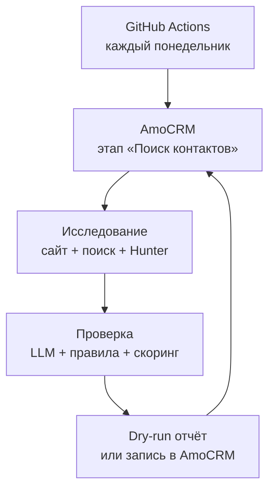

# Архитектура

Система stateless: единственным источником очереди и итоговых связей остаётся AmoCRM. GitHub Actions даёт расписание и журнал запусков. Поэтому отдельная база и постоянно работающий сервер для MVP не нужны.

## Поток одной компании

1. `AmoCRMClient` получает сделку, связанную компанию, сайт и уже связанные контакты.
2. Tavily при наличии ключа ищет официальный сайт и публичные страницы с целевыми ролями.
3. `WebsiteCrawler` обходит максимум `MAX_PAGES_PER_SITE` страниц того же домена. Он не делает широкий краулинг.
4. Hunter ищет публичные адреса по домену. Верификатор включается отдельно.
5. OpenAI получает только собранные фрагменты. Structured Output задаёт строгую схему результата. После ответа код повторно проверяет, что каждый email и URL действительно присутствует в исходном тексте.
6. Кандидаты с одинаковым нормализованным email объединяются. Проверенная версия адреса имеет приоритет над неизвестной.
7. Скоринг ранжирует ЛПР. Один официальный общий адрес может пройти как fallback.
8. Перед созданием контакта AmoCRM ищется точное совпадение email или телефона.
9. В режиме `apply` контакт связывается со сделкой или становится основой новой сделки. В примечание попадают балл и URL источников.
10. Если все записи успешны, исходная сделка перемещается в `AMO_SUCCESS_STATUS_ID`.

## Почему без отдельной БД

- исходные сделки уже образуют очередь;
- точная проверка каналов в AmoCRM даёт дедупликацию;
- перемещение обработанной сделки даёт checkpoint;
- отчёты Actions обеспечивают аудит каждого запуска;
- секреты остаются в GitHub Secrets.

Отдельная PostgreSQL/Supabase понадобится позже, если потребуется история изменения контактных данных, распределённая очередь, ручной интерфейс модерации или повторная проверка контактов по собственному расписанию.

## Режимы записи

| Режим | Поведение | Когда использовать |
|---|---|---|
| `enrich` | контакт привязывается к исходной сделке | основной и наиболее безопасный сценарий |
| `new_lead` | на каждый выбранный контакт создаётся новая сделка | когда продажи хотят отдельную попытку на каждого ЛПР |

Для `new_lead` обязательны `AMO_OUTPUT_PIPELINE_ID`, `AMO_OUTPUT_STATUS_ID` и перемещение исходной сделки после успеха. Это предотвращает повторное создание одинаковых сделок.
