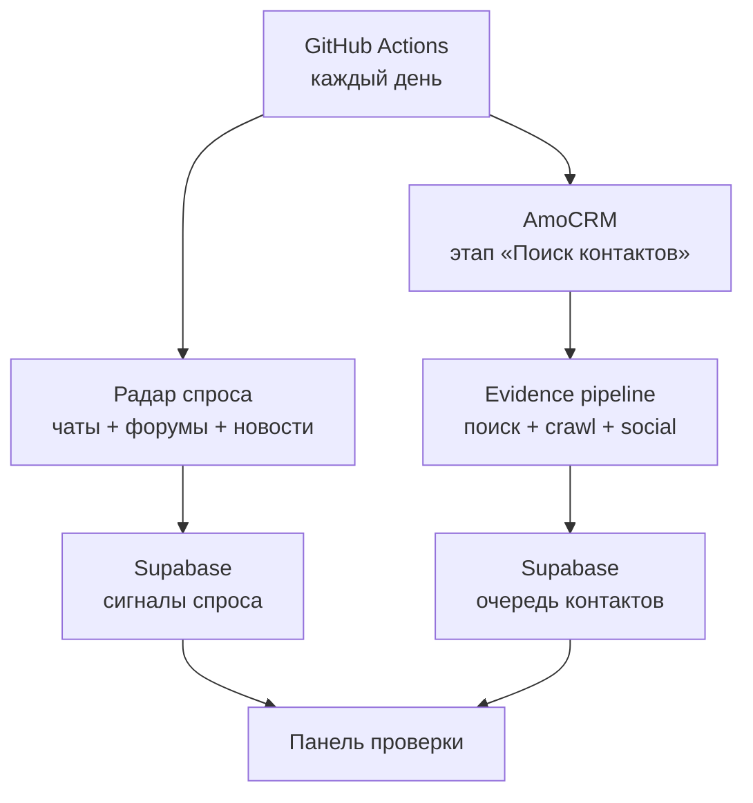
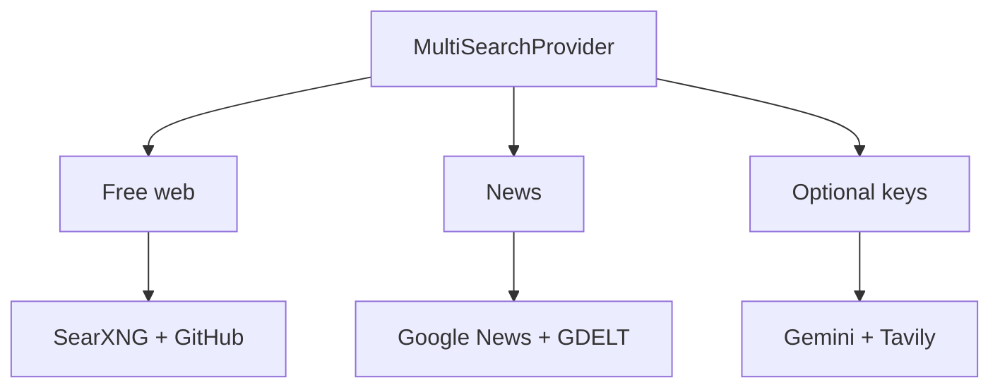

# Архитектура

Система не требует постоянно работающего собственного сервера. AmoCRM остаётся источником исходной очереди, GitHub Actions выполняет тяжёлый поиск, Supabase хранит короткую очередь модерации, а Cloudflare Workers отдаёт приватную панель.

## Поток одной компании

1. `AmoCRMClient` получает сделку, связанную компанию, сайт и уже связанные контакты. Если связанной компании нет, название берётся из `AMO_COMPANY_NAME_FIELD_ID`, затем из названия сделки.
2. `MultiSearchProvider` параллельно запускает SearXNG, Google News RSS, GDELT и GitHub. Gemini/Tavily подключаются только при наличии ключей. Результаты объединяются по URL, а отказ одного источника не останавливает компанию.
3. Из CRM и search results определяется официальный домен. Common Crawl даёт исторические полезные URL, которые не считаются доказательством, пока не проверены на живом сайте.
4. `WebsiteCrawler` соблюдает `robots.txt`, рекурсивно читает sitemap, RSS/Atom и WordPress endpoints, извлекает PDF и ограниченно рендерит почти пустые SPA через Playwright. HTML, metadata и JSON-LD входят в evidence.
5. Детерминированные правила извлекают ФИО, целевые роли, буквально опубликованные email, телефоны и social profiles. Для трёх перспективных людей запускается отдельная матрица person-запросов.
6. Найденные публичные Telegram, VK, YouTube, Rutube, TenChat, Threads, Instagram, LinkedIn и GitHub-профили открываются отдельным ограниченным crawler: из публичной страницы извлекаются описание, текст, email, телефоны и перекрёстные social links.
7. Hunter и OpenAI остаются дополнительными providers. Любой результат обязан сохранить URL-источник; отсутствие ключей не блокирует pipeline.
8. Кандидаты с одинаковым email, social URL или парой ФИО+должность объединяются. Email маркируется `FOUND`, `GENERAL` или `INFERRED`; MX — только доменный сигнал, не mailbox verification.
9. Объяснимый скоринг учитывает официальный источник, роль, прямой канал, professional/social profile, свежесть и отрицательные признаки. Один официальный общий адрес может пройти как fallback.
10. Перед созданием контакта AmoCRM ищется точное совпадение email или телефона. `INFERRED` email никогда не передаётся в CRM.
11. В обычном цикле кандидат вместе с полным audit сохраняется в закрытой очереди. После одобрения панель запускает `sync-approved`; в примечание попадают балл, причины и URL источников.
12. Если все записи успешны, исходная сделка перемещается в `AMO_SUCCESS_STATUS_ID`.

## Поток радара спроса

1. Из каталога более 500 коммерческих формулировок ежедневно выбирается ротационная выборка по разным услугам, источникам и типам намерения.
2. SearXNG, Google News, GDELT, RSS, Hacker News и Stack Exchange работают без пользовательских ключей; YouTube включается опционально.
3. Результат получает категорию услуги, тип намерения, свежесть, прямые каналы, объяснимый балл и fingerprint URL.
4. Supabase upsert обновляет `last_seen_at`, не создавая дубль. В панели сигнал можно отметить как интересный или нерелевантный.

## Провайдеры

Common Crawl и WebsiteCrawler запускаются после выбора домена, поэтому они находятся вне общего search fan-out. Это позволяет применять robots, доменный бюджет и живую перепроверку URL.

## Зачем Supabase

- исходные сделки уже образуют очередь;
- точная проверка каналов в AmoCRM даёт дедупликацию;
- перемещение обработанной сделки даёт checkpoint;
- отчёты Actions обеспечивают полный аудит каждого запуска;
- Supabase хранит только очередь модерации и журнал запусков;
- RLS закрывает прямой доступ к таблицам;
- Edge Function проверяет сессию и allowlist администратора;
- секреты остаются в GitHub и Supabase server-side secrets.

## Режимы записи

| Режим | Поведение | Когда использовать |
|---|---|---|
| `enrich` | контакт привязывается к исходной сделке | основной и наиболее безопасный сценарий |
| `new_lead` | на каждый выбранный контакт создаётся новая сделка | когда продажи хотят отдельную попытку на каждого ЛПР |

Для `new_lead` обязательны `AMO_OUTPUT_PIPELINE_ID`, `AMO_OUTPUT_STATUS_ID` и перемещение исходной сделки после успеха. Это предотвращает повторное создание одинаковых сделок.
